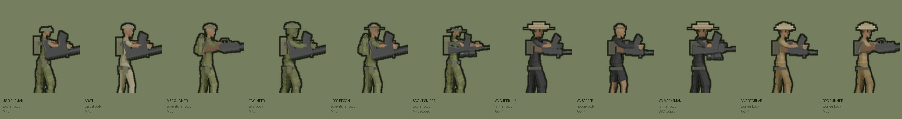

# VIETNAM '65 — LANES OF WAR

A browser lane-tactics game set in the Vietnam War, 1965–69. Vanilla HTML5
canvas and WebAudio: **no dependencies, no build step**. Open `index.html`.

Documentary in tone — neither side is glorified.



## Play

```bash
python3 tools/devserver.py 8931   # any static server works
```

Then open <http://localhost:8931>.

`` ` `` or `F3` toggles a frame-time readout (FPS, ms, p95, render scale).

## What it is

Three lanes, a CP economy, and morale as the win condition. You deploy **squads**,
not individual soldiers, and give them orders: advance, hold, fall back, frag,
smoke. Squads take cover, get pinned, bound forward under covering fire, and earn
veterancy that carries through the match. Commendation points earned across
matches buy standing perks.

- **Asymmetric sides.** US/ARVN firepower and armour against VC/NVA concealment,
  tunnels, spider holes and ambush.
- **Cover that means something.** Trenches, dikes, sandbags, watchtowers, MG
  nests, jungle hides and firing ports cut into village buildings. Protection
  scales with range, so a close assault breaks a position that small arms cannot.
- **Vehicles.** The M113 shrugs off rifle fire (~105 rounds) and dies to a
  satchel or a rocket (2). The AI buys RPG teams when it sees armour.
- **Night operations.** On Khe Sanh the muzzle flash is the only light there is.

## How the art is made

Every soldier, building, tree and vehicle is rendered to 2D from a 3D model
through **one locked orthographic side camera**, so the whole scene agrees on
where the viewer is standing. Frame-to-frame consistency is guaranteed by
construction rather than by hand.

See **[SPRITE_PIPELINE.md](SPRITE_PIPELINE.md)** — including the failures worth
knowing about.

```bash
bash tools/render_all_sprites.sh          # all units, ~3 min
bash tools/render_all_sprites.sh rifleman # one unit, ~18 s
Blender -b --python tools/render_props.py -- --res 512   # scenery
python3 tools/tone_props.py assets/props                 # palette + outline
```

## Tests

```js
// in the browser console
fetch('tools/selftest.js').then(r=>r.text()).then(eval)
  .then(()=>SelfTest.ready()).then(()=>SelfTest.run(55))
```

Plays every map as both sides through the real frame loop and asserts on
outcomes — shots fired, casualties taken, CP never negative, no NaN, nobody
below their lane, muzzle points on the man — plus asset integrity.

## Docs

| file | what |
|---|---|
| [PLAN.md](PLAN.md) | the running plan: mechanics register, priorities |
| [SPRITE_PIPELINE.md](SPRITE_PIPELINE.md) | how the art is made, and the traps |
| [V3_PLAN.md](V3_PLAN.md) | squad / cover / orders design |
| [V1_PLAN.md](V1_PLAN.md) | the original art-gap diagnosis |

## Credits

Character and scenery models by **Quaternius** (CC0). Provenance in
`art/models/SOURCE.txt`. Code MIT — see [LICENSE](LICENSE).
